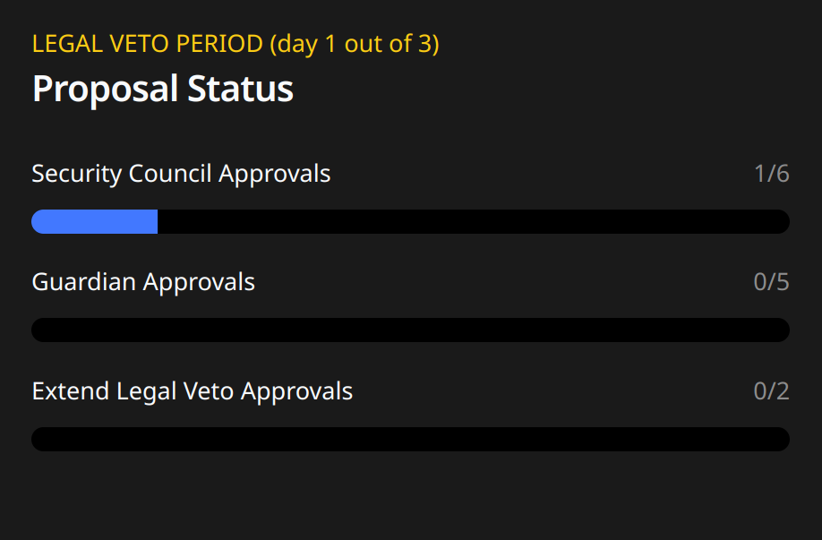

# Standard Upgrades: User Guide

## 🎯 **Objective**

The objective of the rehearsal is to make guardians and security council members comfortable with the tools used to approve upgrades.

## 📝 **Preparation**

### 1. Access to Safe and your signing wallet

Every signer of this rehearsal will [sign through a safe](https://safe.global/). Please ensure you have access to your safe and everything needed to produce your signature. This includes having access to your EOA included in the safe (for example, your hardware wallet at hand and linked with MetaMask or your preferred interface for signing will be required). 

> [!Note]
***For rehearsals, please remember to choose Ethereum **Sepolia Testnet** as the network for all your interactions.***`

### 2. Access to governance web app

Please ensure you have access to the ZkSync Upgrade Analysis & Approval Web App. This web app is used to coordinate the process of gathering signatures and, in the end, broadcasting the transaction that executes the upgrade.

- Staging link: [https://verify.staging.zknation.io/](https://verify.staging.zknation.io/)

### 3. Tally proposal

After a regular upgrade is proposed, the L2 voting happens through Tally. The following process starts after the proposal has gone through this step.

- [Tally Testnet](https://www.tally.xyz/gov/testnet-zksync)
- [Tally Mainnet](https://www.tally.xyz/gov/zksync)

Even though this flow doesn’t happen in Tally, it's useful to search for the upgrade there to see what the upgrade should do in plain English. Then, contrast that with the actual raw changes of the upgrade. Identifying the Tally upgrade will be useful for proposal recognition and verification.

> [!Note]
👍🏽 All interactions by the members of the security council and the guardians during this rehearsal are off-chain, **so they will not need ETH or any other tokens to fund transactions.** *On-chain transactions will be made by the facilitator of the rehearsal.*

## ✅ **Approval through the web app**

### Step 1: Logging into the governance tool using SAFE

The governance web app is used to follow the [standard protocol upgrade procedure](https://docs.zknation.io/zksync-governance/schedule-1-standard-governance-procedures#id-3.-protocol-governor-proposal-process). It facilitates gathering the necessary signatures for updating the protocol. Finally, it builds the transactions that validate all the gathered signatures on-chain and execute the upgrade.

The first step involves logging into the governance tool using **SAFE through WalletConnect integration.** 

> [!Note]
For more info, please refer to the connect using SAFE section of the docs.

Now, back to the governance web app, you will see that you are already logged in, and you should see something as follows:

## Step 2: Find the target Upgrade Proposal and Review General Details

Let’s start going to the standard upgrade section:

If you click on "Standard Upgrades," you will notice that the upgrade proposal you aim to approve should be in the active standard proposals section:

🚨 If you expect to see a proposal and can't find it in this section, please check the following:
1. **Is the proposal ready to be approved?** (Remember that the “[5. ZKSync Era Proposal Execution](https://docs.zknation.io/zksync-governance/schedule-1-standard-governance-procedures#id-3.-protocol-governor-proposal-process)” step should be complete for the proposal to be ready for approval.)
2. **Can you find the proposal on-chain?**
If the answer to both questions is yes, please contact the ZKSync Association to report this bug.

Once you select the target upgrade proposal ID, you will visualize further details regarding the proposal and the approval process:

> [!IMPORTANT]  
🚨 **Proposal ID should be provided by the ZKsync Association for approval through official communication channels.**

> [!Note]
  👍🏽 **To verify the previous step was done correctly, please check that you can see the address of your SAFE and your role at the top.**

Here is a **quick guide to navigate** through this visualization: 

→ **Proposal Details:** At the **top left**, you can see general information about the upgrade proposal. Here you will find details to identify the proposal. You can further review the transaction hash for more details. 

→ **Proposal status:** At the **top right**, the app shows data regarding the proposal status. This mainly provides insights into the current approvals for both Guardians and Security Councils, as well as information about any Extend Legal Veto approval that may be in place.

→ **Security Council Actions or Guardians Actions:** The actions on the bottom left are specific to your account. For example, security council members will only see an "approve" button because their only possible action is to approve the proposal.

→ **Proposal Actions:** The actions on the bottom right are not tied to any specific role. Anyone can perform them at the appropriate time, but they all involve on-chain transactions. For example, "Execute security council approval" can only be done when six members of the security council have approved the upgrade, and the legal off-chain veto period has ended.

> [!Caution]
👍🏽 To complete this step, please verify that the ID of the upgrade is correct. Check it multiple times, compare it with your own data, review the transaction hash, and double-check that it's the upgrade you expect to approve.

## Step 3: Verify Upgrade Proposal integrity

This is the moment when the upgrade information should be verified and double-checked.  

→ **Upgrade Analysis**: At the **bottom of the page**, the app will display a series of reports about the upgrade to aid analysis.

However, each signer needs to do their own verification. **Remember that this is a security-focused procedure, so you should not trust anything, not even the information displayed by the browser**. You must keep an eye out for anything that may seem off and review with external tools that the data showcases what you expect. Even if it looks as expected in the app, you must do your outside verification before proceeding. 

> [!Caution]
🚨 **Each signer is responsible for the verification process**. You should perform your own integrity analysis and verify all web app data with external sources to confirm before proceeding. 

As a general reminder, signers should review: 

→ Official communications

→ Upgrade code changes

→ Tally voting

→ Web App Analysis

→ Etc. 

**Everything that is considered necessary to verify the integrity of the proposal must be reviewed during this process.**

## Step 4: Sign for the approval of the Upgrade Proposal

Once you verify all the data and feel comfortable with the upgrade, you can add your signature to approve the proposal by **clicking the "approve proposal” button**. 

This will send a petition to sign in your safe that includes the action (ApproveUpgradeSecurityCouncil) and the ID of the upgrade. 

**What comes next is REALLY important  👇🏽**

> [!Caution]
🚨 **It’s extremely important to check that the ID matches the ID of the upgrade you want to sign**. Whatever is signed here is being approved to make a protocol upgrade, so it’s very important to check, double-check, and triple-check the correctness of that ID. Don't rely solely on the ID shown in the web app; please verify this proposal ID as thoroughly as possible before proceeding.

After checking the ID, you can click on the sign. From there, two possible flows could follow: 

- **Pending signatures from SAFE:** The minimum threshold to sign will need to be reached in SAFE to sign the proposal. In this case, the signature will be pending in SAFE till this happens.
- **Minimum threshold reached:** If the minimum amount of confirmations for the SAFE is reached, safe will automatically send the final signature to the governance web app.

Once the confirmations are reached and the message is signed through SAFE, the signature will be collected and you should see that 1 approval is registered in the governance tool. The signature created by your SAFE is saved off-chain by the web app, in a local database.

> [!Note]
👍🏽  *If you are not the last signer of your safe, you will not see any change in the governor web app. That’s fine. When every signer of the safe approves the upgrade, a single signature is registered for the entire safe.*

## Step 5: Executing the upgrade

Once **6** members of the security council approve the upgrade, a transaction is needed to register those approvals on-chain. The facilitator of the process will handle this.

As described in point [3.9](https://docs.zknation.io/zksync-governance/schedule-1-standard-governance-procedures#id-3.-protocol-governor-proposal-process), there is now a 24-hour period before the upgrade can be executed. The facilitator will be responsible for executing the final transaction for the upgrade and then notifying the participants once the rehearsal is over.