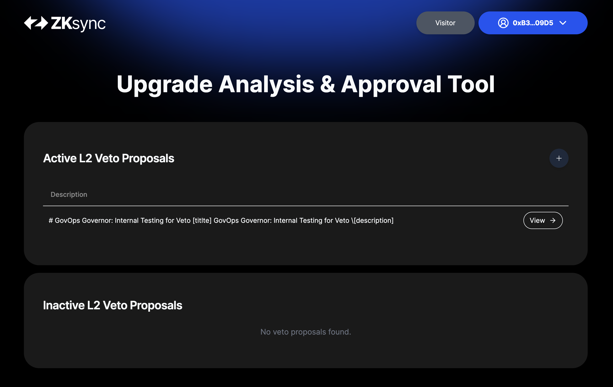

# Guardian On-Chain Veto: User Guide

## 🎯 **Objective**

The objective of this documentation is to guide the guardian members through the tool & process used to exercise an onchain veto on any proposal submitted to the Token Governor or the GovOps Governor.

## 📝 **Preparation**

### 1. Access to Safe and your signing wallet

Every signer of this rehearsal will [sign through a safe](https://safe.global/). Please ensure you have access to your safe and everything needed to produce your signature. This includes having access to your EOA included in the safe (for example, your hardware wallet at hand and linked with MetaMask or your preferred interface for signing will be required). 

> [!Note]
***For rehearsals, please remember to choose Ethereum **Sepolia Testnet** as the network for all your interactions.***`

### 2. Access to governance web app

Please ensure you have access to the ZkSync Upgrade Analysis & Approval Web App. This web app is used to coordinate the process of gathering signatures and, in the end, broadcasting the transaction that executes the upgrade.

- Staging link: [https://verify.staging.zknation.io/](https://verify.staging.zknation.io/)

> [!Note]
👍🏽 All interactions by the members of the security council during this rehearsal are off-chain, **so they will not need ETH or any other tokens to fund transactions.** *On-chain transactions will be made by the facilitator of the rehearsal.*

## ❄️ **On-chain Veto through the web app**

> [!TIP]
💡 As we may talk about **"veto proposals"** and **"governor proposals"**, it is important to remind that first one refers **to the app proposals for vetoing**  and the second one refers to the governance proposals on the **Token Governor and GovOps Governor contracts.** We will be further improving the terminology & documentation to make it more clear in the near future.

### Step 1: Logging into the governance tool using SAFE

The governance web app is used to follow the [On-chain Veto procedure](https://docs.zknation.io/zksync-governance/schedule-4-zksync-guardians#id-3.-onchain-veto). It facilitates proposing a veto & gathering the necessary signatures for its approval. Finally, it builds the transactions that validate all the gathered signatures on-chain and executes the veto.

The first step involves logging into the governance tool using **SAFE through WalletConnect integration.** 

> [!Note]
For more info, please refer to the connect using SAFE section of the docs.

Now, back to the governance web app, you will see that you are already logged in, and you should see something as follows:

## Step 2: Find the Veto Section and Review Active Veto Details

Let’s start going to the L2 Proposals Veto section:

If you click on "Veto Requests", you will enter the following section with existing proposals to Veto L2 Governor proposals:

> [!TIP]
💡 Remember that you will only see here "veto proposals" that are meant to be voted by the guardians. In other words, you will only see here lists of proposals created to veto an underlying GovOps or Token Governor proposal.

Below are the two key sections on this page:

1. **Active L2 Veto Proposals:** The section lists current active veto proposals pending to be approved by the Guardians. Remember, this are "veto proposals" that are meant to be vetoed by the guardians.

2. **Inactive L2 Veto Proposals:** This section displays the inactive veto proposals due to them being already approved or the underlying proposal not actually active to be vetoed anymore. 

> [!Note]
**Navigation**: You can click on **the arrow (->)** to view more details about each proposal or the **“+” button** to add a new proposal.

> [!Note]
Remember that to create a new veto proposal, you will need to have a proposal on the **GovOps or Token Governor contract in active or pending status**. 

## Step 3: Verify Veto Proposal Information

This is the moment when the veto proposal information should be reviewed.

> [!Note]
For both Token Governor and GovOps Governor, the veto proposals follow the same structure.

When you click on a specific veto proposal, you are brought to a detailed view where you can explore various aspects of the proposal. This view is crucial for understanding the specifics of the GovOps or Token proposalt that under voting to be veto and the information set when the veto proposal was created. The section is divided into four main parts:

1. **Proposal Details:** This section provides the key information related to the veto proposal, the underlying GovOps or Token Governor proposal, and the configurations set when the veto proposal was created.

2. **Veto Status:** The status section tracks the approval progress of the proposal. The bar and counter indicate how many approvals have been gathered out of the total required. For example, “0/5” suggests that none of the five required approvals have been obtained yet.

3. **Role Actions:** This area will display actionable options relevant to the user’s role. Only users with the Guardian role will be able to view in this section the approve veto button. 

4. **Execute Actions:** In this section, the execute veto button will allow you to carry out the veto specified in the proposal. However, it will only be clickable (i.e., not grayed out) once all conditions, like approvals, are satisfied.

5.**L2 Call**: This section displays information related to the underlying GovOps or Token Governor proposal that is being voted to be vetoed.

> [!Caution]
🚨 **Each signer is responsible for the verification process**. You should perform your own integrity analysis and verify all web app data with external sources to confirm before proceeding. 

**Everything that is considered necessary to verify the integrity of the proposal must be reviewed during this process.**

## Step 4: Sign for the approval of the Veto Proposal

Once you verify all the data and feel comfortable with the upgrade, you can add your signature to approve the proposal by **clicking the "approve” button**. 

This will send a petition to sign in your safe that includes the action (it will depend on the type of proposal) 

**What comes next is REALLY important 👇🏽**

> [!Caution]
🚨 **It’s extremely important to check that everything matches to the veto proposal you want to approve**. Whatever is signed here is being approved may affect the protocol, so it’s very important to check, double-check, and triple-check the correctness of the information before signing.

> [!WARNING]
🚨 **Information in the message may be long and scrolling inside the message may be necessary to read it.**

After reviewing all the information, you can click on sign. From there, two possible flows could follow:

- **Pending signatures from SAFE:** The minimum threshold to sign will need to be reached in SAFE to sign the proposal. In this case, the signature will be pending in SAFE till this happens.
- **Minimum threshold reached:** If the minimum amount of confirmations for the SAFE is reached, safe will automatically send the final signature to the governance web app.

Once the confirmations are reached and the message is signed through SAFE, the signature will be collected and you should see that 1 approval is registered in the governance tool. The signature created by your SAFE is saved off-chain by the web app, in a local database.

> [!Note]
👍🏽  *If you are not the last signer of your safe, you will not see any change in the governor web app. That’s fine. When every signer of the safe approves the upgrade, a single signature is registered for the entire safe.*

## Step 5: Executing the veto

Once approval threshold is reached, a transaction is needed to register those approvals on-chain. The facilitator of the process will handle this.

> [!Note]
For more information on the veto process, please refer to the [the veto section](https://docs.zknation.io/zksync-governance/schedule-4-zksync-guardians#id-3.-onchain-veto).